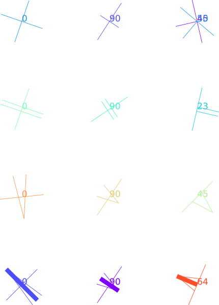

# Usage
1) Enter data into a csv file, whose name matches the CSV_FILE in `config.py`. This csv file must have the following header columns (additional columns may also be present, such as "site" in `example_data.csv`):

|easting|northing|strike|dip|dip direction|plane_type|
|-------|--------|------|---|-------------|----------|

The dip direction should be in letter format, with a maximum length of 2 letters - i.e. the options are `n,ne,e,se,s,sw,w,nw`.

2) Change `GRID_INTERVAL` (in mm) and `MAP_SCALE` as necessary to match your data. The default in `config.py` is for 8 figure grid references on a 1:10k map.

3) If a magnetic correction is required, change `MAGNETIC_CORRECTION` in `config.py`. This value is added to each strike value after standardisation: `strike = standardise_strike(strike,dip,dip_dir)+config.MAGNETIC_CORRECTION` (line 155 of `dip_strike.py`).

4) Run `dip_strike.py`, which will produce an output svg file whose name is defined by `SVG_FILE` in `config.py`.

Note: currently, the accepted `plane_type`s are:
- `foliation`
- `bedding`
- `vein`
- `joint`

For `joint` and `vein`, the symbols for horizontal and vertical dips are a bit strange at the moment - however, the script should plot the dip magnitude as well, which can be used to identify planes in these specific orientations.
# Output
The scale of the output svg should be such that the dips and strikes can be directly copied and pasted into their correspondingly scaled OS map then just translated for alignment (no scaling necessary). Note: one way to constrain this alignment is to add a fake data point (e.g. horizontal bed) at a round location (i.e. lies on a map grid line intersection) and align all the structural measurements within the group by matching that point to the expected location. Some other config options (all in the units of pixels):
- `LINE_THICKNESS` primarily controls the thickness of strike lines, along with some dip lines
- `FONT_SIZE` is for the dip magnitude text
- `STRIKE_LINE_LENGTH` controls the length of each plotted strike line
- `CUSTOM_COLOUR` is either an empty string or a valid hexademical colour code (with the # in front) that sets the colour of all drawn components

The config option `PLOT_DIPLESS_STRIKES` (= `True` or `False`) controls whether strikes without corresponding dips are plotted as just strikes lines or omitted.

The script separates different plane types into groups, though does not separate them into different layers - this can be done manually in the svg file if desired. Colours and grouping are used to separate different dip and strike measurements at the exact same location. The dip magnitude text can be moved manually as desired by the user. Colours can also be redefined in `config.py` by changing `CUSTOM_COLOUR` (e.g. to "#000000" for black) or in Inkscape (e.g. by selecting all lines of a group and setting line colour to black). After separation to different layers, the dips and strikes may be ungrouped and irrelevant dips and strikes removed.

See `dipstrikes.svg` for an example output, or below for an image of what the output may look like (going from top to bottom row: bedding, foliation, joint and vein):

Note: if the svg is being opened in Inkscape, the svg elements won't necessarily be on the canvas.

# Dependencies
- matplotlib (for colours)
- numpy
- pandas

# GNU GPL License Notice
Copyright (C) 2022  Yingbo Li

This program is free software: you can redistribute it and/or modify
it under the terms of the GNU General Public License as published by
the Free Software Foundation, either version 3 of the License, or
(at your option) any later version.

This program is distributed in the hope that it will be useful,
but WITHOUT ANY WARRANTY; without even the implied warranty of
MERCHANTABILITY or FITNESS FOR A PARTICULAR PURPOSE.  See the
GNU General Public License for more details.

You should have received a copy of the GNU General Public License
along with this program.  If not, see <https://www.gnu.org/licenses/>.
